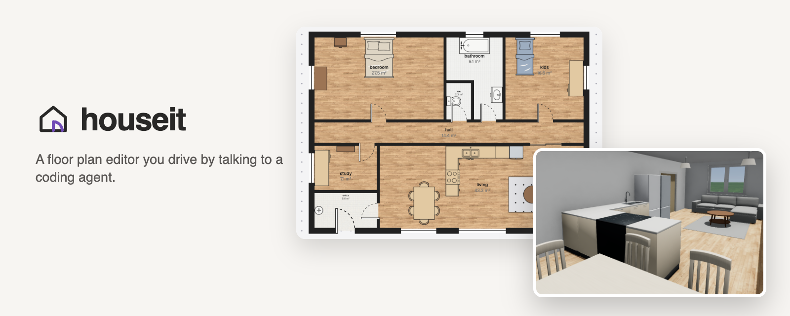
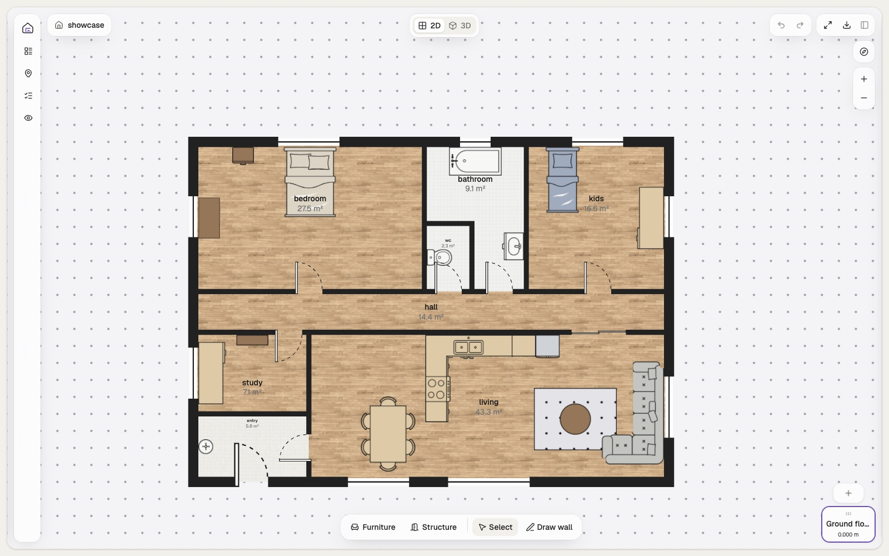
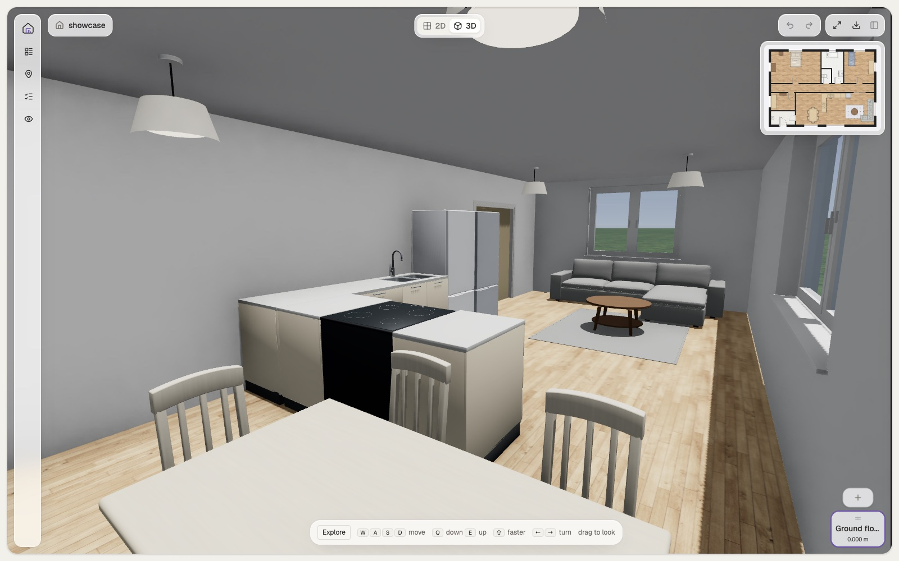
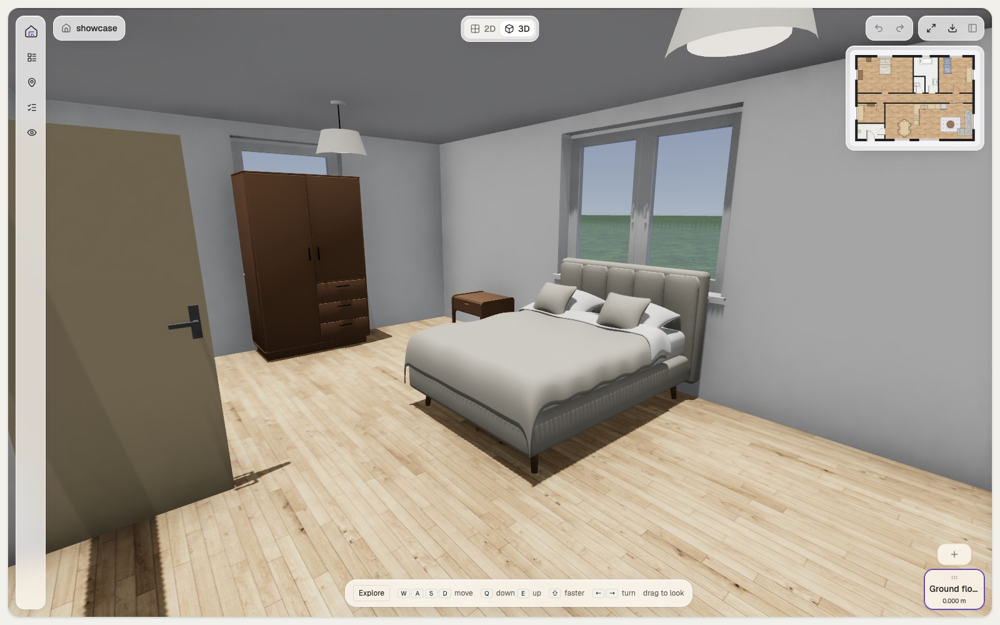

<div align="center">



**A floor plan editor you drive by talking to a coding agent.**

[](https://github.com/Empatixx/houseit/actions/workflows/ci.yml)
[](https://empatixx.github.io/houseit)
[](https://www.typescriptlang.org/)
[](https://bun.sh/)
[](https://r3f.docs.pmnd.rs/)
[](https://modelcontextprotocol.io/)
[](LICENSE)

</div>

You describe the house in plain language. Claude Code or Codex turns that into commands,
sends them through an MCP server to a browser tab, and the plan redraws in front of you.
Then you grab a wall and drag it, because some things are faster by hand — and the drag
runs the very same command the agent would have sent.

Everything runs locally: no account, no backend. Plans live in your browser's IndexedDB.

## Showcase

<table>
  <tr>
    <td colspan="2" align="center">
      
      <br><b>The plan</b> — rooms derived from the walls, doors that know which way they swing, furniture placed against named walls
    </td>
  </tr>
  <tr>
    <td width="50%" align="center">
      
      <br><b>Walk through it</b> — the same document at eye height
    </td>
    <td width="50%" align="center">
      
      <br><b>Every room</b> — real wall heights, sills, glazing and modelled furniture
    </td>
  </tr>
</table>

<div align="center"><sub>The house above is <a href="apps/editor/public/plans/showcase.txt"><code>showcase.txt</code></a> — forty-odd commands, nothing drawn by hand.</sub></div>

## How it works

```
  you ──▶ agent (Claude Code / Codex)
                │
                │  one MCP tool: floorplan("add-room --name kitchen …")
                ▼
          MCP server ──── CDP ────▶ Chrome tab
                                      │
                                      ▼
                                 window.floorplan.exec()
                                      │
                                      ▼
                              document ──▶ redraw
```

The browser tab owns the document; the MCP server holds no state. So what the agent reads
back is exactly what you see. Every command answers with the rooms it touched, read back in
full — each wall with what opens and stands on it and the stretches still free — and every
problem the plan now has: a room nobody can reach from the front door, a door the sofa
blocks, a living room with no window.

## Quick start

```bash
git clone https://github.com/Empatixx/houseit.git
cd houseit
bun install
bun run dev                          # the editor on http://localhost:5173
bun run --cwd apps/mcp build         # bundles the MCP server and the CLI
```

Open <http://localhost:5173/?plan=showcase> to load the house from the screenshots.

### Connect an agent

**Claude Code** picks up `.mcp.json` from the repository root, so a session opened here is
enough. To register it globally:

```bash
claude mcp add houseit -- node /absolute/path/to/houseit/apps/mcp/dist/server.js
```

**Codex** reads `~/.codex/config.toml`:

```toml
[mcp_servers.houseit]
command = "node"
args = ["/absolute/path/to/houseit/apps/mcp/dist/server.js"]
```

Then say what you want — *"a 12 by 9 metre house, kitchen on the west, two bedrooms
along the north"* — and watch the tab. With no Chrome on the debugging port the server
starts one headless; run `scripts/chrome.sh` first if you want to watch.

## Features

| Area | What it does |
|---|---|
| **Walls and rooms** | A topological wall graph; rooms are derived faces, so two rooms always share one wall. Cut a room off a side, out of a corner, by corner points or by a walk of legs |
| **Openings** | Doors (hinged, sliding, pocket, garage) and windows, centred in the widest free stretch unless told otherwise; a door swings into the room it was named from |
| **Furniture** | A catalogue of typed objects with real sizes, finishes and footprints; placed against walls, refused where it would stand in a wall or block a door |
| **Storeys and stairs** | Levels stacked at their real heights; staircases drawn at the tread count the storey calls for, with the well above derived from the flight |
| **Checks** | Reachability from the front door, door clearances, room proportions, missing windows, stairwells under furniture — in every answer, not behind a question |
| **2D plan** | Orthographic plan with symbols, floor finishes, dimensions, snapping, drag-to-edit — every drag is one typed command |
| **3D walk** | First-person walk-through of the whole house, every storey at its real height, with a minimap |
| **Projects** | Many plans on a home screen, each at its own address, saved to IndexedDB with undo/redo |
| **Agent interface** | One stable MCP tool, structured JSON answers and a picture of what changed |

## Development

```bash
bun run dev                 # editor with hot reload
bun run test                # vitest through turbo
bun run typecheck && bun run lint && bun run depcruise && bun run knip
bun run build               # runs every check above, then builds the editor and the CLI
```

## Contributing

Issues and pull requests are welcome. Before opening a pull request, run the checks above —
CI runs the same ones. A change that an agent cannot express as a command is incomplete:
if something can only be done by editing the document directly, the command language is
what needs to grow.

## License

Licensed under the [Apache License, Version 2.0](LICENSE).
