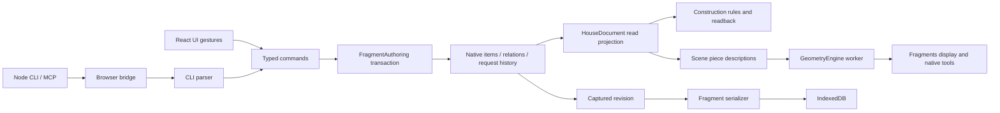

# Architecture on `that-open-engine`

This describes the implementation on the active That Open branch. The remaining
engine migration is tracked in [goal.md](goal.md); separate reliability, modularity
and performance work is in [maintenance progress](docs/maintenance/progress.md).

## Data and edit flow

`core`, `geometry`, `commands` and `scene` are plain TypeScript libraries. They
contain construction and placement rules, not renderer objects. Dependency Cruiser
forbids React, Three.js and Node built-ins there; Turbo boundaries keep apps from
importing one another. Explicit file imports replace barrel exports.

The editor composes these libraries with That Open, Zustand and React. `edit/`
translates gestures into typed commands. CLI strings are parsed only at the driver
boundary. A script is transactional; a failed command discards its draft. Queries
such as `get-plan` skip topology rebinding.

## Authoring and identity

`engine/fragment-authoring.ts` owns one public That Open
`SingleThreadedFragmentsModel`. Items, relations and native request boundaries are
the authoring authority. `authoring-graph.ts` maps domain entities and relationships
to/from native records. `nested-authoring.ts` gives columns, roofs, ramps, shafts,
measured stairs and site parts independent native identities and relations. Wall
elements keep stable identities when topology splits
into segments; named rooms store IDs, boundary references, anchors and finishes.
Their geometry and area are derived.

`store/document-store.ts` publishes the current `HouseDocument` projection and
history availability. Immer provides drafts for command compilation; editor undo
and redo select native request boundaries. Patch helpers in `packages/commands`
remain useful for pure command consumers and tests, but are not the editor's
history authority. Read-only queries preserve document and store references.

## Generation and presentation

GeometryEngine runs in a shared worker with asynchronous request IDs and a bounded
geometry cache. Supported walls, profiles, primitives, sheets and terrain go through
that path. Houseit retains construction semantics: room closure, openings/hosts,
floor/well derivation, roofs, furniture placement and circulation.

`FragmentDisplay` manages derived per-viewport models, native representations and
local-ID/owner mapping. These models are presentation, not independent authoring
histories. Native tools query the displayed Fragments for selection, snapping,
measurements and cuts. There is no permanent invisible interaction copy.

React/R3F hosts cameras, scene composition, UI handles and annotations. Appearance
adapters retain materials, UVs and plan symbols on native geometry. Imports, text,
textures and genuine UI helpers remain application responsibilities. Temporary
source-mesh gesture previews and complete archive geometry are tracked in the
parallel migration; removing R3F alone would not complete that work.

`ui/panel.tsx` resolves selection and delegates to separate room, wall, opening,
object and camera inspectors. Shared field controls are in `ui/panels/fields.tsx`.
Furniture glyph presentation, drag, rotation and ghost dimensions have separate
modules; all commits still go through typed commands.

## Projects and persistence

`store/projects/project-store.ts` owns project transitions, the database connection,
writer and save state. It imports neither React nor Sonner nor routing. The small
`projects.ts` composition module supplies the browser singleton and React hook.
A dependency rule protects persistence from UI imports.

`codec.ts` captures a native authoring revision. `fragment-project.ts` serializes
that snapshot without appending a request to live history. At the maintenance
baseline, archives contain authoring data for the project but native geometry only
for walls; full geometry serialization is a separate migration requirement.
Native authoring schema 3 upgrades schemas 1/2 while retaining native IDs; stored
legacy documents also have loading paths and fixtures.

`autosave.ts` serializes encoding/writes, retains retryable failures and coalesces
pending edits. It publishes pending/saving/error/saved state. Only the latest queued
revision becoming durable produces saved state. IndexedDB has separate metadata
and document stores; failed open/read/write operations reject. Document creation
precedes publishing its metadata so a failed write cannot appear as a valid empty
project. This is not a cross-tab synchronization protocol.

`SaveNotice` displays a persistent error with retry at the top right, then updates
the same toast on success. Ordinary saves are quiet. UI navigation follows a
successful close/flush; failed close retains the document and native history. An
unload listener protects pending edits. CLI/MCP explicitly awaits `bridge.save()`
before reporting durable success.

## Commands and extensions

Zod schemas define command arguments. `defineCommand` provides typed application,
strict argument parsing and metadata for generated help. The browser bridge returns
structured results and construction warnings. The MCP tool title, description and
input schema remain stable; command help is returned as data.

The current schema already has disciplines, wall/level hosts, devices and circuits.
Electrical wall-device commands exist. This is not yet a complete MEP workflow.
New professions must reuse command transactions, host relationships, validation and
scene descriptions instead of creating their own document/history or renderer.
Concrete composition points and host obligations are documented in
[discipline extensions](docs/maintenance/discipline-extensions.md).

## Toolchain and verification

| Concern | Implementation |
| --- | --- |
| Packages and orchestration | Bun workspaces, Turbo |
| Type checks | TypeScript, strict indexed access |
| Formatting and lint | Biome |
| Dependency checks | Turbo boundaries, Dependency Cruiser, Knip |
| State and argument validation | Zod, Zustand, Immer drafts |
| Native engine | Installed `@thatopen/fragments`, components and GeometryEngine |
| UI | React, R3F, Three.js, Tailwind, shadcn/ui, Sonner, react-router |
| Unit/integration tests | Vitest, fake IndexedDB, real native archive fixtures |
| Browser regressions | Isolated Chrome/Playwright sessions and CLI commands |
| Agent driver | Node, MCP SDK, Playwright/CDP |

`bun run build` runs the dependency checks, lint, types, tests and production builds.
`bun run test:regression` runs actual interaction/archive scenarios; see
[regression tests](docs/regression-tests.md). Tests run under Vitest, not Bun's
native test runner. The Node CLI/MCP runtime is required by the current driver.

Known scaling costs include full native graph projection/validation after edits,
readback surveys and scene updates. Measure them on representative models before
adding global caches. The optional performance scenario records command/save
latency, pointer-to-frame timing and main-thread heap across project switches;
these development measurements are not production FPS or total GPU/worker memory.
